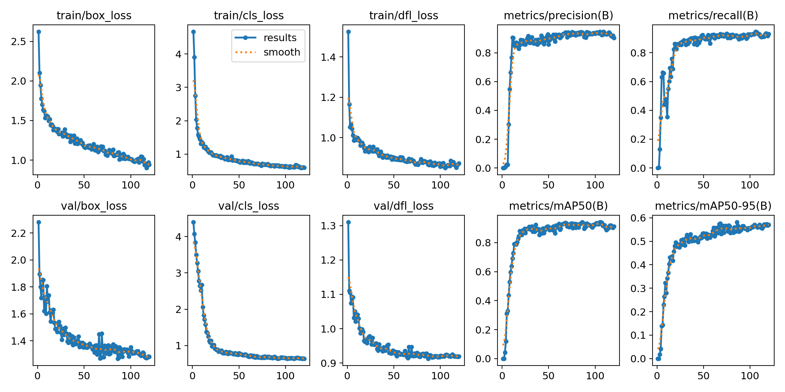
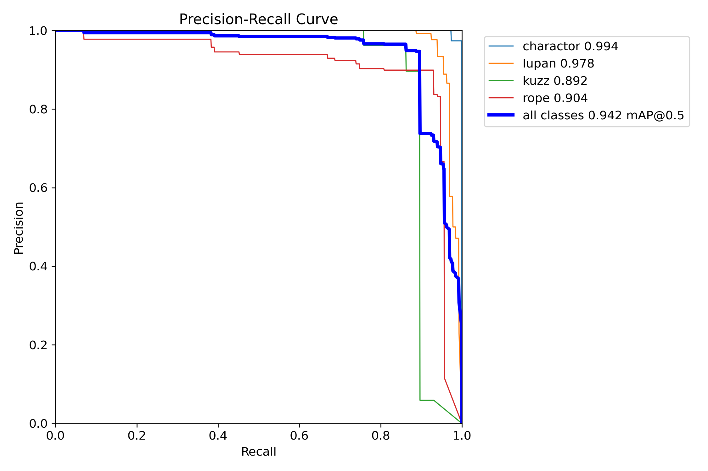
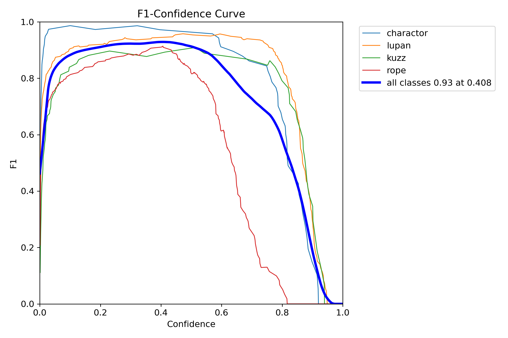
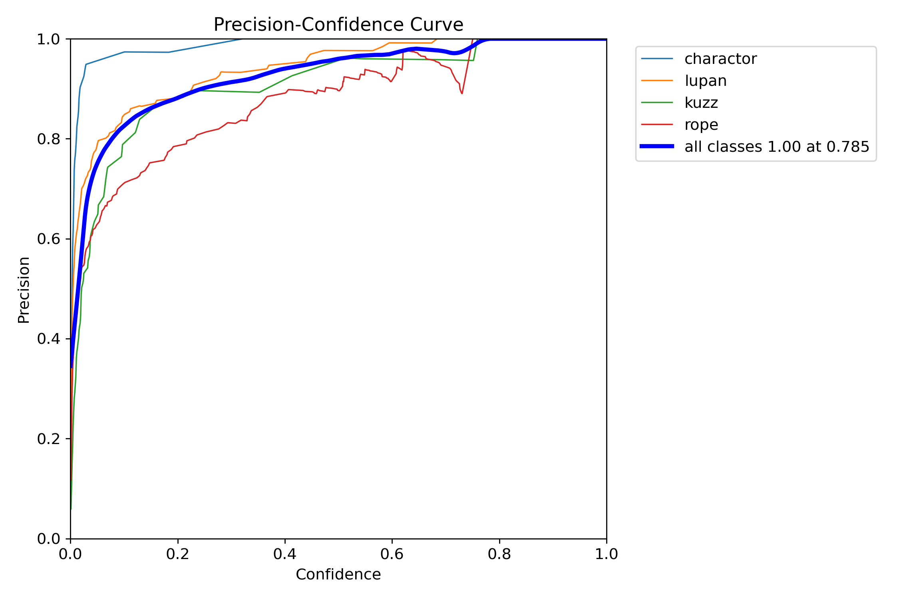
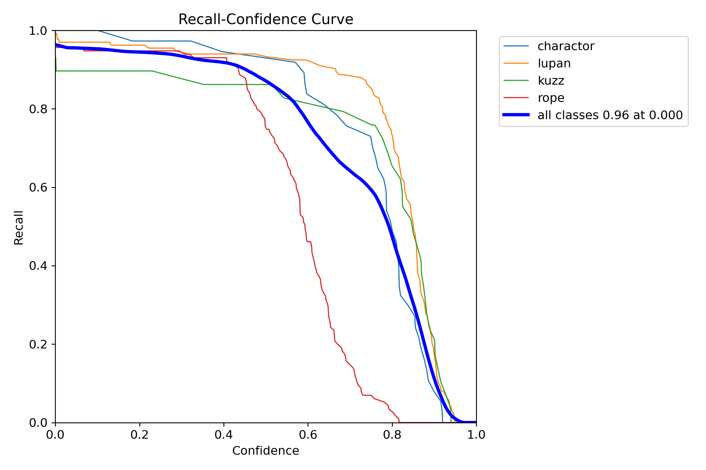
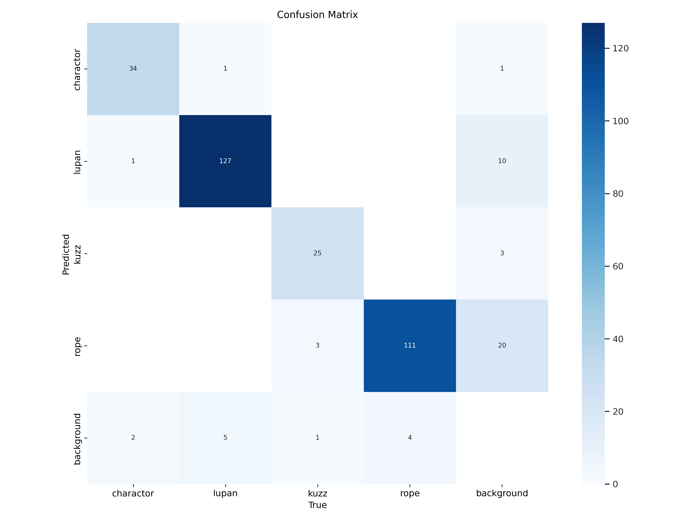
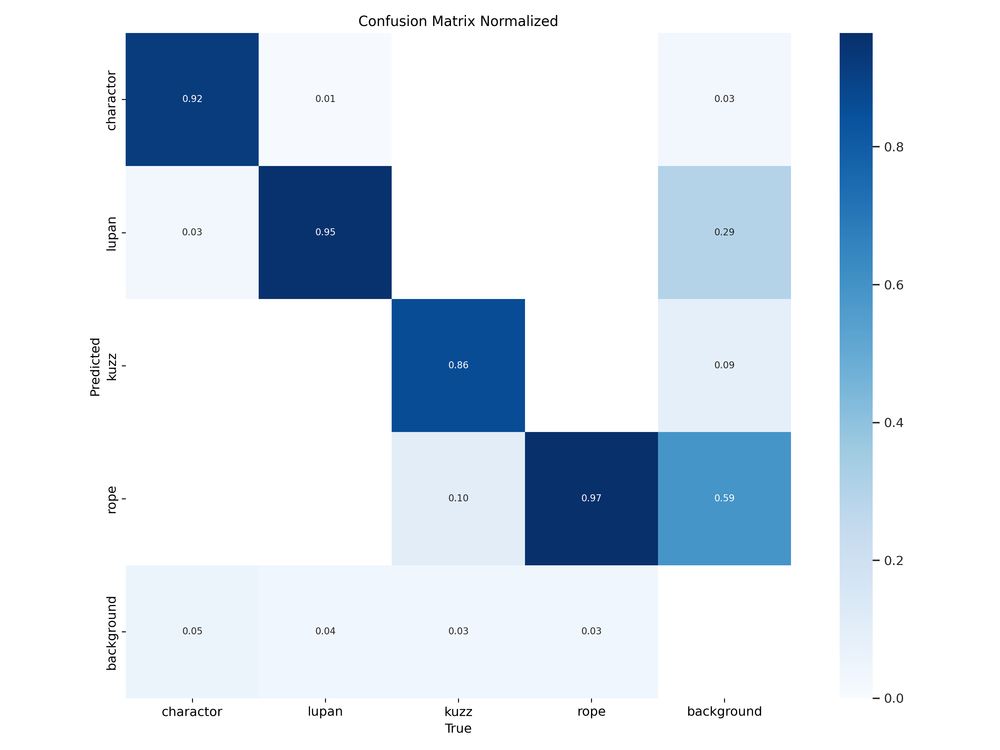
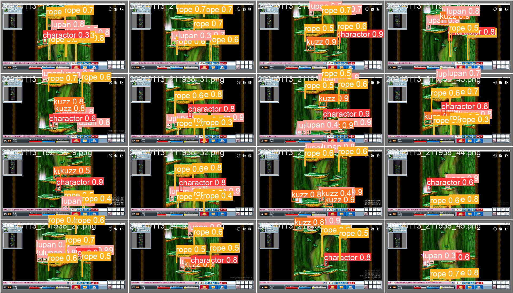
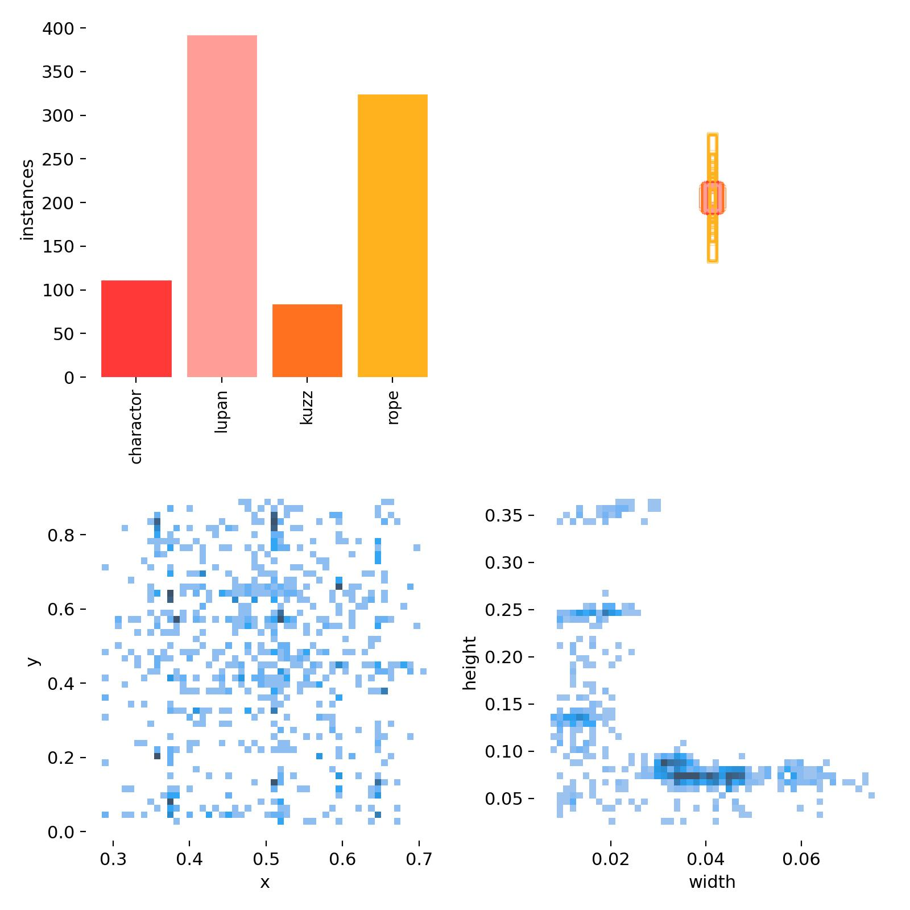

# 메이플랜드 - 남쪽 던전(프리스트) 자동 사냥 매크로

이 프로젝트는 '메이플랜드' 게임에서 남쪽 던전에서 프리스트 캐릭터를 위한 자동 사냥 매크로입니다.

## 주의사항

이 매크로는 교육 및 연구 목적으로 개발되었으며, 인게임에서 사용하지 않았습니다.

## 주요 기능

- 객체 인식 AI를 활용한 캐릭터 및 몬스터 감지
- 자동 이동 및 스킬 사용
- 미니맵 기반 위치 파악
- 자동 힐링 및 버프 시스템

## 파일 구조 및 역할

### 메인 스크립트
- `macro.py`: 메인 매크로 프로그램으로 객체 인식, 캐릭터 조작, 스킬 사용 등 핵심 기능 제공
  - YOLO 모델을 사용하여 게임 화면에서 캐릭터와 몬스터(루팡, 커즈아이) 감지
  - 감지된 객체의 위치에 따라 적절한 스킬 사용 및 이동 로직 구현
  - 멀티프로세싱을 통한 자동 이동 및 스킬 사용 기능

### 유틸리티 스크립트
- `automove.py`: 미니맵 이미지 매칭을 기반으로 자동 이동 기능 구현
- `minimap_matching.py`: 미니맵과 미리 저장된 이미지를 매칭하여 현재 위치 파악
- `Auto.py`: 기본적인 자동화 기능 (스킬 사용, 힐링 등)을 멀티스레딩으로 구현
- `getwindow.py`: 게임 창의 위치와 크기를 감지
- `getxy.py`: 마우스 좌표 확인 도구
- `find.py`: 화면에서 특정 오브젝트 찾기 도구
- `test2.py`: 테스트 스크립트
- `capture_test.py`: 화면 캡처 테스트 도구

## 기술 스택

- Python 3.x
- OpenCV (이미지 처리)
- PyAutoGUI (화면 제어)
- YOLO (객체 탐지)
- Numpy (데이터 처리)
- Torch (AI 모델)
- Keyboard (키보드 입력 제어)
- 멀티프로세싱/멀티스레딩 (병렬 처리)

## 작동 원리

1. YOLO 모델을 사용하여 게임 화면에서 캐릭터와 몬스터를 실시간으로 감지
2. 감지된 객체의 위치에 따라 자동으로 이동 및 스킬 사용
3. 미니맵 매칭을 통해 현재 위치 파악 및 효율적인 이동 경로 결정
4. 스킬 쿨다운 및 HP/MP 관리를 통한 지속적인 사냥 유지
5. 여러 프로세스/스레드를 활용하여 동시에 여러 기능 수행

## 사용 방법

1. 필요한 라이브러리 설치
2. YOLO 모델 학습 데이터 준비 및 모델 학습/로드
3. `macro.py` 실행하여 매크로 시작
4. 백틱(`) 키를 눌러 매크로 토글

## 모델 학습 세부 사항항

- Pretrained YOLO(You Only Look Once) v8 nano 사용
- 직접 Screenshot 및 Bounding Box Labeling을 적용한 데이터셋 사용 (약 200개 이미지)
- NVIDIA RTX 3060 TI GPU를 사용하여, Conda 환경에서 학습 수행

## 모델 학습 결과 (Metrics)

### 예측 예시

### 전체 학습 결과

학습이 진행됨에 따라 정확도(precision), 재현율(recall), mAP@0.5, mAP@0.5:0.95 모두 점진적으로 향상되었으며, 손실(loss) 값은 안정적으로 감소했습니다.

### 정밀도-재현율 곡선 (PR Curve)

모든 클래스에서 PR 곡선이 우상단에 가깝게 형성되어 높은 정확도와 재현율을 보여주고 있습니다.

### F1 점수 곡선

신뢰도 임계값 0.4~0.8 구간에서 높은 F1 점수를 유지하며, 특히 '캐릭터' 클래스가 가장 높은 성능을 보입니다.

### 정밀도 곡선 (Precision Curve)

신뢰도 임계값이 증가할수록 정밀도가 상승하며, 약 0.7 이상의 신뢰도에서 모든 클래스가 높은 정밀도를 보입니다.

### 재현율 곡선 (Recall Curve)

신뢰도 임계값이 낮을수록 재현율이 높으며, 약 0.4 이하의 신뢰도에서 모든 클래스가 80% 이상의 재현율을 보입니다.

### 혼동 행렬 (Confusion Matrix)

대각선에 높은 값이 집중되어 있어 대부분의 객체가 정확히 분류되었음을 보여줍니다.

### 정규화된 혼동 행렬

정규화된 혼동 행렬에서도 대각선에 높은 값(0.8 이상)이 집중되어 매우 높은 분류 정확도를 보여줍니다.

### 검증 데이터 예측 결과

실제 게임 화면에서 캐릭터와 몬스터를 높은 신뢰도로 정확하게 감지하고 있습니다.

### 레이블 분포
